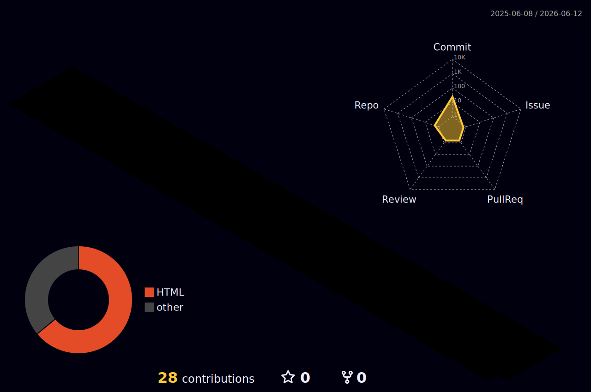

# Hi, I'm Mohamad Reza! 👋

A passionate web developer from Iran 🇮🇷

---

## 🚀 About Me

- 🎯 Focused on **Fullstack Web Development**
- 🌱 Learning React · Django · PostgreSQL
- 💼 Working toward freelance projects
- 🔧 Built: crypto analysis system, hotel management app, Anki Chrome extension
- 📫 rezaforgehub@gmail.com

---

## 💻 Tech Stack

### Frontend

### Backend

### Tools

---

## 📊 GitHub Stats

---

*"Every expert was once a beginner."*
